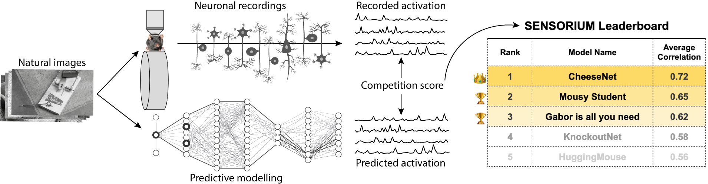

<a href="https://github.com/psf/black"></a>
[](https://github.com/activeloopai/Hub)

<hr />

# SENSORIUM 2022 Competition



SENSORIUM is a competition on predicting large scale mouse primary visual cortex activity. We will provide large scale datasets of neuronal activity in the visual cortex of mice. Participants will train models on pairs of natural stimuli and recorded neuronal responses, and submit the predicted responses to a set of test images for which responses are withheld.

Join our challenge and compete for the best neural predictive model!

For more information about the competition, vist our [website](http://www.sensorium2022.net/).

# Important Dates
**01.06.2022**: Start of the competition and data release. The data structure is similar to the data available at https://gin.g-node.org/cajal/Lurz2020.
<br>**15.10.2022**: Submission deadline.
<br>**22.10.2022**: Validation of all submitted scores completed. Rank 1-3 in both competition tracks are contacted to provide the code for their submission.
<br>**05.11.2022**: Deadline for top-ranked entries to provide the code for their submission.
<br>**15.11.2022**: Winners contacted to contribute to the competition summary write-up.

# Starter-kit

Below we provide a step-by-step guide for getting started with the competition.

## 1. Pre-requisites
- install [**docker**](https://docs.docker.com/get-docker/) and [**docker-compose**](https://docs.docker.com/compose/install/)
- install git
- clone the repo via `git clone https://github.com/sinzlab/sensorium.git`

## 2. Download neural data
There are two ways to download the data:
1. Through shell application (git via gin)
    ```bash
    git clone https://gin.g-node.org/cajal/Lurz2020 sensorium/notebooks/data
    ```
2. Download the data from https://gin.g-node.org/cajal/Lurz2020 and unzip it into `sensorium/notebooks/data`

## 3. Run the example notebooks

### **Start Jupyterlab environment**
```
cd sensorium/
docker-compose run -d -p 10101:8888 jupyterlab
```

### **Example notebooks**
We provide four notebooks that illustrate the structure of our data, our baselines models, and how to make a submission to the competition.
<br>[**Notebook 1**](): Inspecting the Data
<br>[**Notebook 2**](): Re-train our Baseline Models
<br>[**Notebook 3**](): Use our API to make a submission to our competition
<br>[**Notebook 4**](): A Full submission in 5 easy steps using our cloud-based DataLoaders
